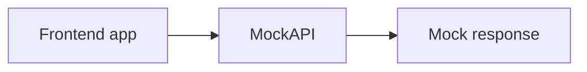
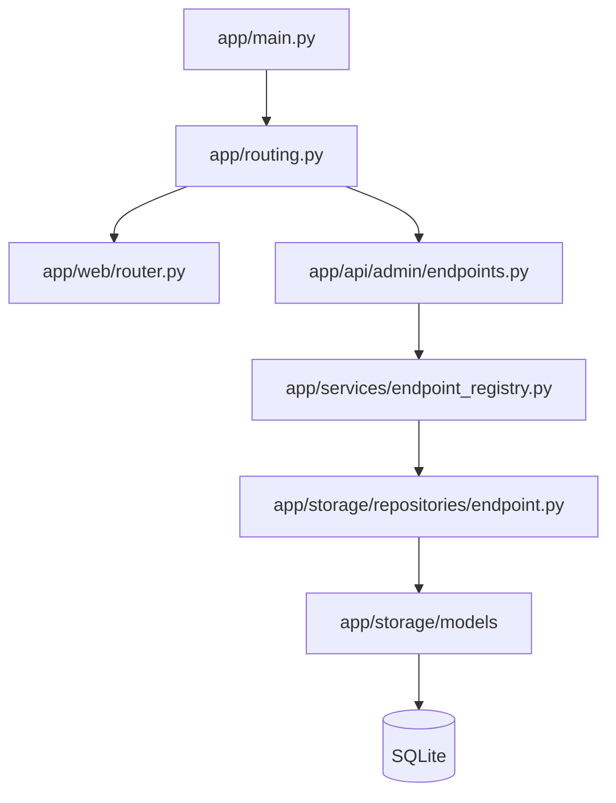
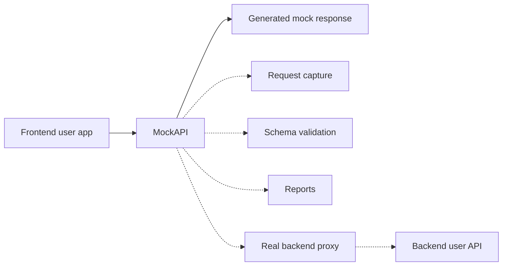

# MockAPI

MockAPI is a work-in-progress API mocking tool for frontend development.

The goal is simple: let frontend developers keep building against realistic API
contracts even when the real backend is incomplete, unstable, or still being
discussed.

Instead of waiting for backend routes to exist, a developer should be able to
define the endpoint shape MockAPI must expose, store that contract, and use it as
a temporary backend during development.

## Why

Frontend work often gets blocked by unfinished backend endpoints. MockAPI is
intended to sit in that gap:



MockAPI is not trying to replace a production backend. It is a development tool
for prototyping, contract alignment, and keeping frontend/backend collaboration
moving.

## MVP Direction

The MVP is focused on a small but useful workflow:

- register mock endpoints from a web interface
- store endpoint metadata and schemas
- list saved endpoints and inspect their details
- receive real frontend requests through MockAPI
- generate fake responses from the registered schema
- capture requests for debugging and future reports

Future work may include schema validation, response validation, request history,
contract reports, and proxy mode so MockAPI can forward traffic to a real backend
while still observing or overriding responses.

Authentication is not a priority for the first MVP. It may be added later, and
Django could be considered for that kind of user/account layer, but the current
application is FastAPI-based.

## Current Status

This project is still early.

Currently implemented:

- FastAPI application bootstrap
- SQLite persistence with SQLAlchemy
- basic web page for registering an endpoint and schema
- endpoint registration persisted in the database

Not finished yet:

- dynamic mock runtime for arbitrary registered paths
- fake data generation
- request capture
- endpoint listing/detail pages
- schema validation and reports
- proxying to a real backend

## Architecture

### Project Structure

```text
MockAPI/
├── app/
│   ├── main.py
│   ├── routing.py
│   │
│   ├── api/
│   │   └── admin/
│   │       ├── endpoints.py
│   │       ├── reports.py
│   │       └── schemas.py
│   │
│   ├── core/
│   │   └── settings.py
│   │
│   ├── services/
│   │   └── endpoint_registry.py
│   │
│   ├── storage/
│   │   ├── database.py
│   │   ├── models/
│   │   │   ├── endpoint.py
│   │   │   └── schema.py
│   │   └── repositories/
│   │       ├── endpoint.py
│   │       └── schema.py
│   │
│   ├── web/
│   │   └── router.py
│   │
│   └── ui/
│       └── templates/
│           ├── home.html
│           └── create_endpoint_form.html
```

### Application Flow



The intended separation is:

- `api/` handles HTTP concerns: requests, dependencies and responses.
- `services/` handles application logic such as registering mock endpoints.
- `storage/` handles persistence details.
- `web/` renders the admin interface.

This keeps the codebase ready to grow without putting backend logic directly in
route handlers.

### Longer-Term Runtime Direction



## Running Locally

### With `uv`

```bash
uv sync
uv run uvicorn app.main:app --reload
```

### With `pip`

```bash
pip install -r requirements.txt
uvicorn app.main:app --reload
```

Then open:

```text
http://127.0.0.1:8000/web
```

The API docs are available at:

```text
http://127.0.0.1:8000/docs
```

## Example Endpoint Registration

The current registration endpoint is:

```http
POST /endpoint
```

Example body:

```json
{
  "method": "GET",
  "path": "/tickets",
  "schema": {
    "id": {
      "type": "integer",
      "required": true
    },
    "title": {
      "type": "string",
      "required": true
    }
  }
}
```

## Roadmap Notes

The next valuable steps are:

1. Add endpoint listing and detail views.
2. Add a catch-all mock router for registered paths.
3. Generate fake responses from schemas.
4. Store request/response interactions.
5. Add validation and simple reports.
6. Add optional proxy mode for real backend integration.

## License

No final license has been selected yet.

Until a `LICENSE` file is added, this repository should be treated as shared for
review and learning only. Commercial reuse, redistribution, or building a
substantially similar product from this code is not currently granted.

The intended licensing direction is source-available rather than permissive open
source. A future option could be a non-commercial or no-competing-use license,
such as one from the PolyForm license family, but this has not been finalized.
