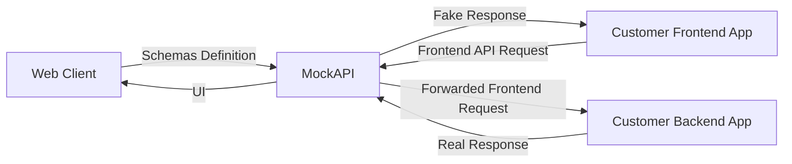

# MockAPI

MockAPI is a lightweight API mocking and testing tool for frontend development. It allows defining API schemas, validating contracts, generating fake responses, and optionally forwarding requests to a real backend. Its goal is to decouple frontend and backend development while keeping responses consistent with the expected contract.

## Current Scope

This README documents only what has been decided so far:

- High-level architecture (Layer 0)
- Internal functional view (Layer 1)
- Current folder structure draft

The diagrams below are currently used as hybrid DFD/flow-style views.

## Architecture

### Layer 0

High-level system view showing the main external actors and the central MockAPI block.



### Layer 1

Internal functional view of the current MockAPI draft, including storage access, contract validation, schema filling, and the core request handling flow.

```mermaid
flowchart LR
    WC[Web Client]
    FE[Customer Frontend App]
    BE[Customer Backend App]

    subgraph M[MockAPI]
        SA[Storage Access<br/>(SQLAlchemy)]
        ST[(Storage<br/>(SQLite))]
        C[Core<br/>(FastAPI)]
        CV[Contract Validation<br/>(Pydantic)]
        SF[Schema Filler<br/>(Faker)]

        SA -->|ORM Queries| ST
        ST -->|ORM Queries| SA

        SA -->|Save/Load Schemas and Analysis| C
        C -->|Validate Contract| CV
        C -->|Fake Data Request| SF
    end

    WC -->|Schemas Definition| C
    C -->|UI| WC

    FE -->|Frontend API Request| C
    C -->|Fake Response| FE

    C -->|Forwarded Frontend Request| BE
    BE -->|Real Response| C
```

## Current Folder Structure Draft

```text
mockapi/
├── app/
│   ├── main.py
│   ├── api/
│   │   ├── frontend.py
│   │   ├── admin.py
│   │   └── proxy.py
│   ├── core/
│   │   ├── request_router.py
│   │   ├── mode_resolver.py
│   │   ├── contract_validator.py
│   │   ├── schema_filler.py
│   │   └── response_builder.py
│   ├── storage/
│   │   ├── models.py
│   │   ├── repositories.py
│   │   └── database.py
│   ├── schemas/
│   │   ├── api_schema.py
│   │   ├── endpoint_config.py
│   │   └── responses.py
│   ├── templates/
│   └── services/
│       ├── schema_service.py
│       ├── analysis_service.py
│       └── proxy_service.py
└── tests/
```

## Notes

This README reflects the current architecture draft only. It does not define implementation details beyond the diagrams and folder structure already discussed.
